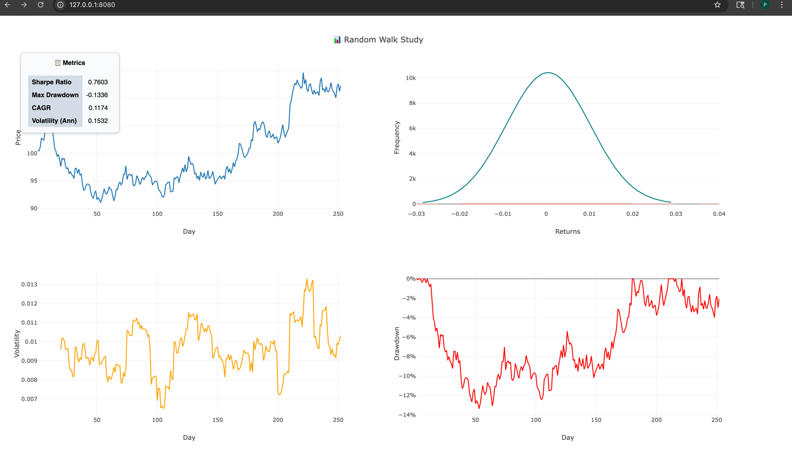

## 📊 Random Walk Hypothesis - Study

This project simulates random walk-based price data and displays an interactive analytics dashboard featuring price movement, volatility, max drawdown, return distribution, and key financial metrics.

It consists of:

* 🐍 **Sanic API**: Generates random price/metric data
* 🌐 **NGINX frontend**: Serves a 4-quadrant dashboard with floating metrics
* 📈 **Plotly.js**: Fully client-side interactive visualization


[Random Walk Hypothesis Concept](./randomwalk.md)

## Development Guideline


### 🧠 Features

| Component                    | Description                                   |
| ---------------------------- | --------------------------------------------- |
| **API**                      | `/data/price`, `/data/metrics`, `/health`     |
| **Simulated Price**          | Random walk using geometric Brownian motion   |
| **Volatility**               | Rolling 20-day standard deviation             |
| **Drawdown**                 | Percentage drop from peak                     |
| **Return Distribution**      | Histogram + normal curve (KDE-like)           |
| **4-Quadrant Plotly Layout** | Price, Volatility, Drawdown, Distribution     |
| **Floating Metrics Panel**   | Sharpe, Max Drawdown, CAGR, Volatility (Ann.) |


### 🔌 API Endpoints

| Method | URL             | Description               |
| ------ | --------------- | ------------------------- |
| GET    | `/data/price`   | Time series price/returns |
| GET    | `/data/metrics` | Summary financial stats   |
| GET    | `/health`       | Health check              |


### 🏗️ Project Structure

```
.
├── app/                    # Sanic backend app
│   ├── controllers/        # API route handlers (metrics, price, health)
│   ├── simulator.py        # Price + return generator
│   ├── statistics.py       # Sharpe, Drawdown, CAGR, Volatility
│   └── app.py              # Sanic startup and blueprint loader
├── nginx/                  # NGINX configuration and static files
│   ├── nginx.conf
│   └── index.html          # Plotly dashboard UI
├── static/                 # Mounted HTML output (optional)
├── Dockerfile              # Builds Sanic app image
├── docker-compose.yml      # Orchestrates Sanic + NGINX
└── requirements.txt
```

### Commands

```help
❯ make help

Available commands:
  build         🏗️ Build Python and Rego policies
  build.docker  🐳 Build application docker image
  build.python  🐍 Build python source
  clean         🧹 Cleanup temporary files created
  clean.infra   🧼 Cleanup the infrastructure
  clean.python  🧽 Cleanup the development environment temporary files
  format.python 🎨 Format code using Ruff (Black-compatible)
  help          📖 Help message
  init.infra    🌐 Create the infrastructure
  init.python   🧰 Initialize the Poetry development environment
  lint.python   🔍 Run static analysis with Ruff and Mypy
  logs.app      📜 View application logs
  start.app     🚀 Start App
  stop.app      🛑 Stop App
  test.python   ✅ Run tests with Pytest and show coverage

```

## 🚀 Running Locally

The following will initialize the environment , create the necessary build artifacts and start the local application;

- Sanic listens on port `8000`
- nginx listens in port `8080`

```bash
make init
make build
make start.app
```

open in browser the page [http://localhost:8080](http://localhost:8080)



### NGINX (`nginx.conf`)

* Serves dashboard from `/`
* Proxies `/data/*` to Sanic

## 🧪 Developer Notes

* All metrics are recomputed on each API request
* JS controls (bin count, KDE toggle) can be extended
* Backend is modular — easy to replace simulator with real data
* Floating metrics box is pure CSS and can be styled/resized


## Improvement to code (TODO)

### Common statistical tests:

- Runs Test (tests randomness)
- Autocorrelation (tests for serial dependence)
- Variance Ratio Test (compares variance over different horizons)

